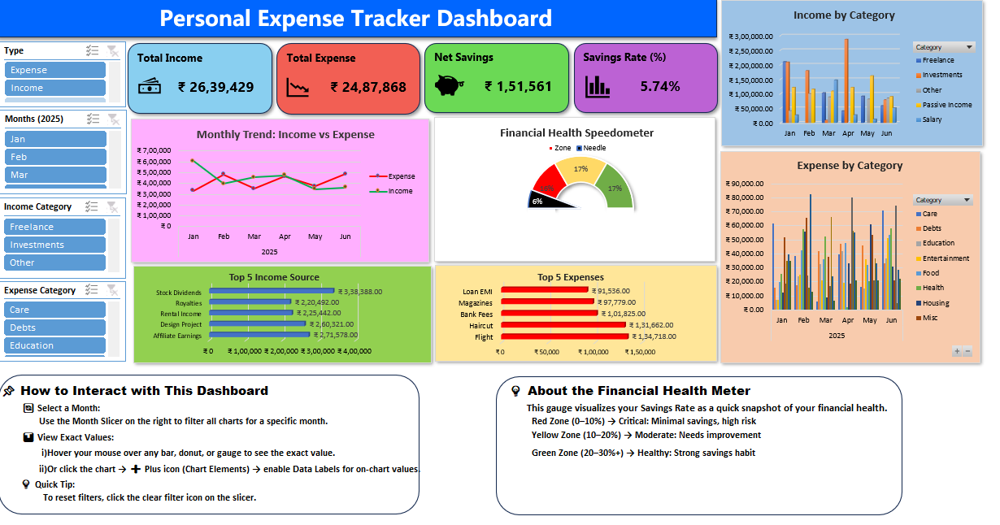
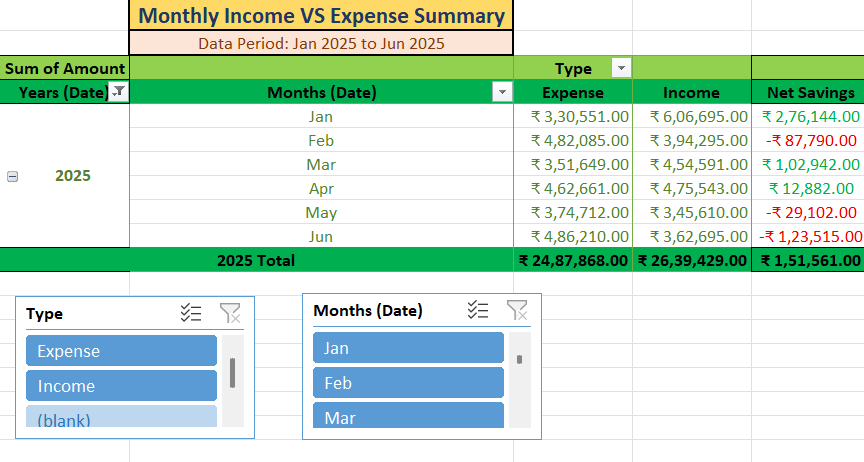
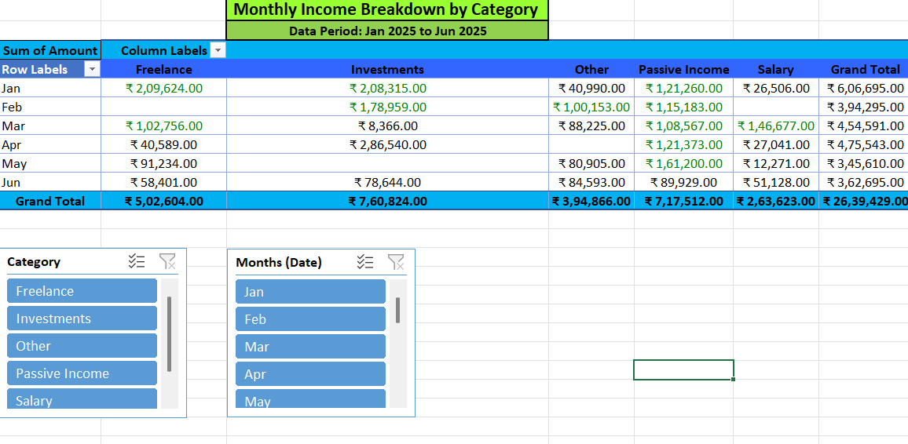
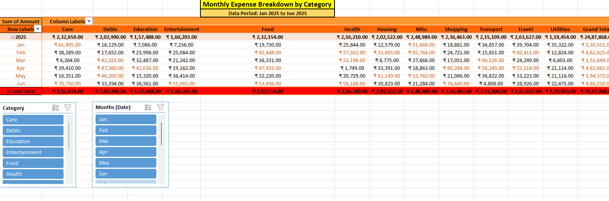
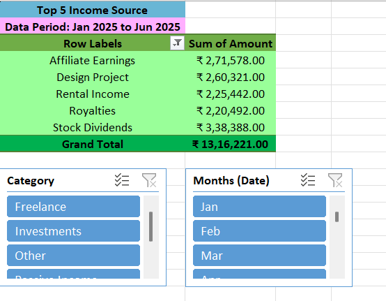
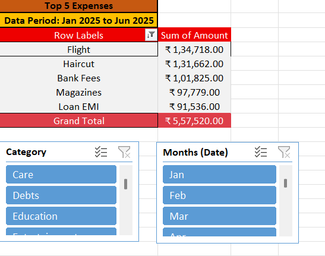

# 🏦 Personal Expense Tracker (Excel + Python)

An automated **personal finance tracker** built in **Microsoft Excel** with **interactive dashboards, KPIs, and pivot tables**.  
It includes a **Python script** that generates synthetic income & expense data for testing the dashboard.  

---

## 🚀 Features

- **Excel Dashboard with KPIs**
  - Total Income, Total Expenses, Net Savings, Savings Rate  
  - Monthly summary with Pivot Tables  
  - Income & Expense breakdown by category  
  - Top 5 expenses visualization  

- **Python Data Generator**
  - Creates synthetic income & expense data  
  - Randomized categories, dates, and amounts  
  - Perfect for testing without real data  

- **Clean & Modular**
  - Separate folders for Excel, Python, screenshots, and optional sample data  

---

## 🗂️ File Structure
```
PersonalExpenseTracker/
├── excel-sheets/
│ └── PersonalExpenseTracker.xlsm # Excel tracker with dashboards & pivots
│
├── python-code/
│ └── personal_income_expense_tracker.py # Generates synthetic raw data
│
├── data/
│ └── sample_raw_data.csv # Optional sample dataset
│
├── screenshots/
│ ├── dashboard.png
│ ├── monthly_incomevsexpense_summary.png
│ ├── monthly_expense_by_category.png
│ ├── monthly_income_by_category.png
│ ├── raw_data.png
│ ├── top5_income.png
│ └── top5_expenses.png
│
└── README.md
```

---

## 📊 Dashboard Highlights

### 1️⃣ Dashboard View  
Interactive dashboard with KPIs, charts, and slicers.  



---

### 2️⃣ Pivot Tables  
- **Monthly Summary**: Shows trends in income, expenses & savings  


- **Income by Category**: Breakdown of earnings sources  


- **Expense by Category**: Detailed spending analysis  


-  **Top 5 Income Source**: Biggest income sources 



---

### 3️⃣ Top 5 Expenses Visualization  
Quickly see where most of your money goes.  



---

## 🧠 Backend Logic
This project combines **Python + Excel** for a seamless workflow:  

- **Python Script** → Generates synthetic raw data with randomized income & expense records  
- **Excel Workbook** → Uses Pivot Tables, slicers, and KPIs to transform data into insights  
- **Dynamic Category Lists** → Auto-updates with new categories from the raw data  
- **Macros Used** → Simple macro to refresh all Pivot Tables automatically when new data is loaded  

The backend sheets in Excel manage:  
- Category mapping  
- Monthly summaries for KPIs  
- Top 5 expense calculations
- Top 5 income calculations 

---

## 🛠️ How to Use
- Raw Data: (Optional) Run the Python script personal_income_expense_tracker.py to generate synthetic income & expense data (raw_data.csv) or paste your own transactions.
- Load Data: Open PersonalExpenseTracker.xlsm and click the Refresh All button (or use the built-in refresh macro). This will automatically update all Pivot Tables and KPIs.
- Dashboard: Instantly view KPIs (Total Income, Total Expenses, Net Savings, Savings Rate), Pivot Tables, and Top 5 Expenses.
- Customize: Edit categories/types via dropdowns or validation lists if you want new income or expense categories.

---

## 🧩 Excel Functions Used
This tracker uses advanced Excel functions for automation:
- SUMIFS → Category & month-based calculations
- GETPIVOTDATA → KPI extractions from Pivot Tables
- TEXT, EOMONTH, MONTH, YEAR → Date formatting
- INDEX, MATCH, XLOOKUP → Dynamic lookups
- IFERROR, IF → Error handling
- UNIQUE, SORT → Auto category management
- Structured Table references for dynamic updates

## 🔄 Macros Used
The Excel file includes a lightweight VBA macro to:
- Refresh all Pivot Tables with one click
- Ensure the dashboard always shows updated data
- No external add-ins or complex VBA required.

---

## 👤 About the Author
**Rajyashree Nandy**
An Excel and Data Analyst enthusiast leveraging data automation to turn raw data into actionable insights.


🔗(Linkedin)[https://www.linkedin.com/in/rajyashree-nandy] | (Github)[https://github.com/RajyashreeNandy]
    
---

## 📜 License
This project is open-source.
✅ You can use, modify, and share it freely.
🙌 Attribution is appreciated!


